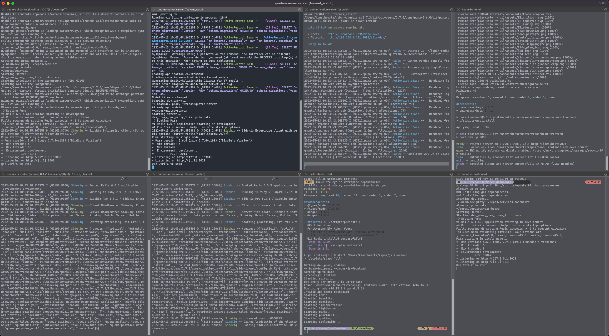

# iterm2-settings

- `Profiles.json` contains a backup of just iTerm2 profiles (includes color/font settings for those profiles)
- `com.googlecode.iterm2.plist` is a full backup of all iTerm2 settings (fonts, colors, profiles, window arrangements, etc) 

## iterm2 split panes
| Command         | Effect                        |
| --------------- | ----------------------------- |
| cmd-d           | Divide session vertically     |
| cmd-shift-d     | Divide session horizontally   |
| cmd-opt-arrow   | Navigate sessions             |
| cmd-shift-enter | Maximize / unmaximize session |

## Importing the layout
If you don't care about any of your iterm2 settings, you can import mine.
```
Iterm2 > Preferences > General > Preferences > Load Preferences from a custom folder > com.googlecode.iterm2.plist
```
Skip to [Launching Local Services](#launching-local-services)

## Building the layout


1. Import `Profiles.json`
```
Iterm2 > Preferences > Profiles > Other Actions > Import JSON Profiles > Profiles.json
```
2. Open the first profile in a new iterm window
```
Profiles > Alt/Option + click beam-api-server
```
3. Open other profiles in new panes
NOTE: The split will occur from the currently selected pane
```
Profiles > Open Profiles > Select the next profile > Click one of the "Split" options
```

## Save the layout
Once the iterm panes are arranged to your liking:

1. Close all other iterm windows - otherwise, [Launching Local Services](#launching-local-services) will re-open all of your windows, not just the services layout
2. Save the window arrangement
```
Window > Save Window Arrangement
```

## <a name="launching-local-services"></a> Launching Local Services
With iterm open, press `cmd + shift + R`. This will open the saved pane layout and launch local services. 